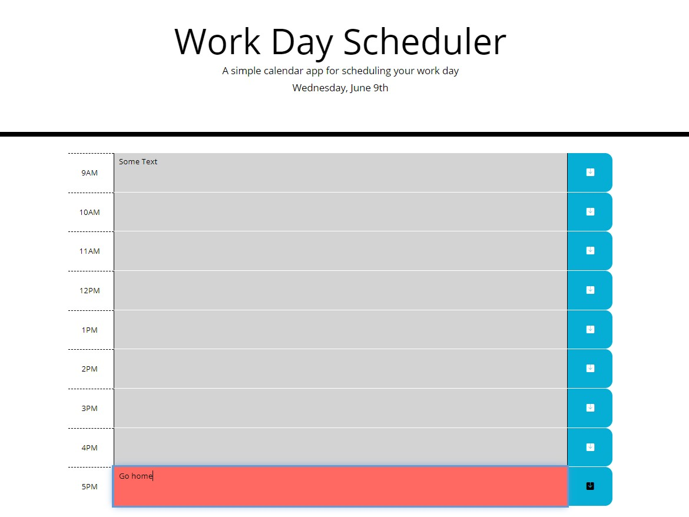

# Work-Day-Scheduler

Deployed Application: https://adriancronin.github.io/Work-Day-Scheduler/

## Description

A daily calendar app for scheduling your work day.

* My motivation for this project was to step away from vanilla JavaScript and dive into working with API's, Libraries and Frameworks.

* This app is for those who want a quick and easy way to organize/plan their day.

* This project got me familiar with how to navigate third-party documentation and how to search for vanilla JavaScript concepts I am familiar with in their documentation.

* Another key concept I learned about is how powerful Template Literals are. I first wanted to see if I could even get Template Literals to generate a single box, when I got that to work I tried to get it to generate a row, and when I got that to work I just kept adding pieces on until essentially the entire page was rendered via Template Literals.

## Usage

Hour-blocks are color coded, grey means the hour has passed, red signifies the current hour and green marks future hours. Text can be entered into the blocks and saved by pressing the blue and white save button at the end of the row.

